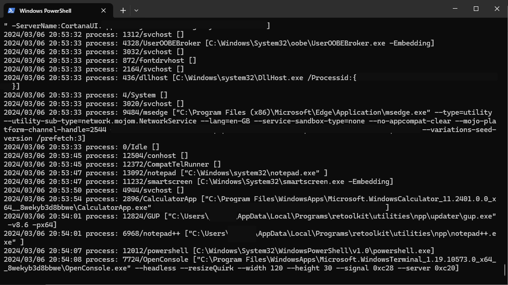
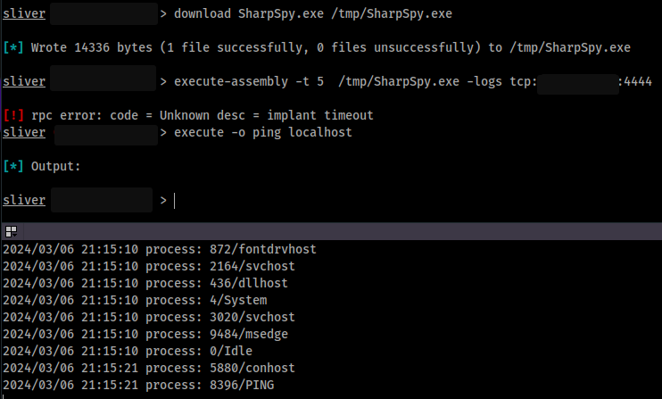

# SharpSpy

A very quick and ugly approach to something similar to [pspy](https://github.com/DominicBreuker/pspy), but for Windows. A lot less polished. And worse in every way :)

Is capable of monitoring,
- process creation (including command lines, if we have proper access)
- killed processes
- filesystem events (create, change, rename, delete)
- clipboard (courtesy of [SharpClipboard](https://github.com/slyd0g/SharpClipboard) - pretty much copy-pasted.. oh, the irony)

Can also write output to the console (`-v`), a logfile (`-log`) or a socket (tcp or udp, `-logs`). The app is pretty useless without at least one of them.

Error handling is pretty much non-existant. Sometimes you get an exception if something isn't working.

And remember: Windows is very noisy when it comes to file and process creation. "The less you hear, the quieter you are". Or something like that.

## Usage
```
Usage: SharpSpy [params...]
  -v                  Verbose output
  -ttl <millis>       How long should the application execute for, in millis (default: forever)
  -np                 Disable process monitor (default: on)
  -k                  Show the pid of killed processes (default: off)
  -cmd                Attempt to show command line of processes (default: off) -- slows us down!
  -pt <millis>        Time to sleep between process checks (default: 500ms)
  -fp <path>          File system path to monitor
  -fe <ev1,ev2,..>    Events to monitor (allowed: change,create,rename,delete, default: all of them)
  -ff <filter>        File system glob filter (e.g *.txt)
  -fr                 Scan filesystem recursively
  -c                  Listen for clipboard events
  -log file           Write log to file instead of stdout
  -logs conn          Write log to a socket (e.g tcp:10.11.12.13:4444)
```



We can use the `-t 5` option in Sliver to background it, while still getting useful error messages during start-up. The lower pane is just a standard `nc -vvnlp 4444`


